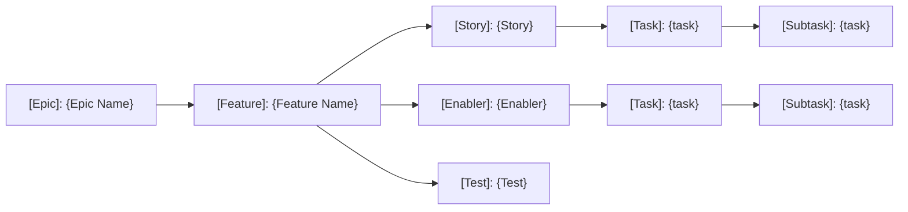
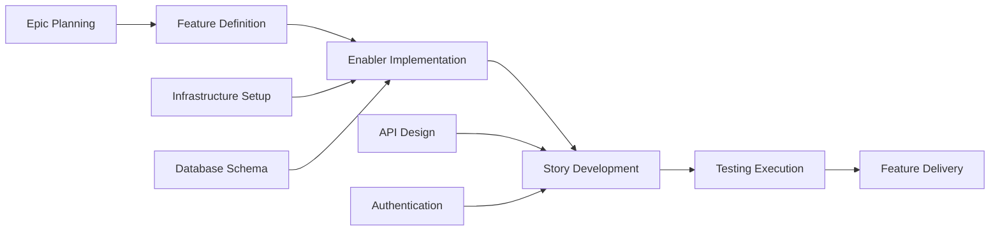

# Issue Planning

## Goal

Act as a senior Project Manager and DevOps specialist with expertise in Kanban methodology and GitHub project management. Your task is to take the complete set of documentation in `docs/` and generate a comprehensive GitHub project plan with automated issue creation, dependency linking, priority assignment, and Kanban tracking.

## Project Management Best Practices

### Agile Work Item Hierarchy

- **Epic**: Large business capability spanning multiple features (a.k.a. milestone)
- **Feature**: Deliverable user-facing functionality within an epic
- **Story**: Requirement that delivers value independently
- **Enabler**: Work supporting stories
- **Task**: Implementation-level work breakdown for stories/enablers
- **Subtask**: Individual units of work supporting a task (optional)
- **Test**: Quality assurance work for validating stories and enablers



### Project Management Principles

- **INVEST Criteria**: Independent, Negotiable, Valuable, Estimable, Small, Testable
- **SMART Criteria**: Specific, Measurable, Achievable, Realistic, and Time Bound
- **Prerequisites**: Clear criteria before work begins
- **Acceptance Criteria**: Quality gates and completion criteria
- **Dependency Management**: Clear blocking relationships and critical path identification
- **Value-Based Prioritization**: Business value vs. effort matrix for decision making

## Output Format

Create two primary deliverables:

1. **Project Plan**: `docs/design/agents/project-plan.md`
2. **Issue Creation Checklist**: `docs/design/agents/{feature}-issues-checklist.md`

## Project Plan Structure

### 1. Project Overview

- **Feature Summary**: Brief description and business value
- **Success Criteria**: Measurable outcomes
- **Key Epics**: Breakdown of major deliverables without timelines
- **Risk Assessment**: Potential blockers and mitigation strategies

### Issues Breakdown

#### Epic Issue Template

```markdown
# [Epic]: {Epic Name}

## Description

{Epic summary}

## Business Value

- **Primary Goal**: {Main business objective}
- **Success Metrics**: {Measurable outcomes}
- **User Impact**: {How users will benefit}

## Prerequisites

{List any conditions that must be met before work can begin.}

## Features

- [ ] #{feature-issue-number} - {Feature Name}

## Acceptance Criteria

- [ ] {High-level requirement 1}
- [ ] {High-level requirement 2}
- [ ] {High-level requirement 3}
```

#### Feature Issue Template

```markdown
# [Feature]: {Feature Name}

**Epic**: {epic-issue-number}

## Description

{Feature summary}

## Prerequisites

{List any conditions that must be met before work can begin.}

## Stories

- [ ] #{story-issue-number} - {Story Title}
- [ ] #{story-issue-number} - {Story Title}

## Enablers

- [ ] #{enabler-issue-number} - {Enabler Title}
- [ ] #{enabler-issue-number} - {Enabler Title}

## Acceptance Criteria

- [ ] {Feature-level requirement 1}
- [ ] {Feature-level requirement 2}

## Dependencies

**Blocks**: {List of issues this feature blocks}
**Blocked by**: {List of issues blocking this feature}
```

#### Story Issue Template

```markdown
# [Story]: {Story Title}

**Feature**: #{feature-issue-number}

## Description

{A story statement, e.g. a User Story}

## Prerequisites

{List any conditions that must be met before work can begin.}

## Subtasks

- [ ] #{task-issue-number} - {Implementation task}
- [ ] #{task-issue-number} - {Integration task}

## Tests

- [ ] #{test-issue-number} - {Test implementation}

## Acceptance Criteria

- [ ] {Specific testable requirement 1}
- [ ] {Specific testable requirement 2}

## Dependencies

**Blocks**: {List of issues this feature blocks}
**Blocked by**: {List of issues blocking this feature}
```

#### Enabler Issue Template

```markdown
# [Enabler]: {Enabler Title}

**Feature**: #{feature-issue-number}

## Description

{Technical work required to support user stories}

## Requirements

- [ ] {Technical requirement 1}
- [ ] {Technical requirement 2}

## Tasks

- [ ] #{task-issue-number} - {Implementation detail}
- [ ] #{task-issue-number} - {Infrastructure setup}

## Stories Enabled

This enabler supports:

- #{story-issue-number} - {Story title}
- #{story-issue-number} - {Story title}

## Acceptance Criteria

- [ ] {Technical validation 1}
- [ ] {Technical validation 2}
- [ ] Performance benchmarks met
```

#### Subtask Issue Template

```markdown
# [subtask]: {Subtask Title}

**Story/Enabler**: #{story/enabler-issue-number}

## Description

{Work required}

## Requirements

- [ ] {Technical requirement 1}
- [ ] {Technical requirement 2}

## Acceptance Criteria

- [ ] {Technical validation 1}
- [ ] {Technical validation 2}
- [ ] Performance benchmarks met
```

### Dependency Management



#### Dependency Types

- **Blocks**: Work that cannot proceed until this is complete
- **Related**: Work that shares context but not blocking
- **Prerequisite**: Required infrastructure or setup work
- **Parallel**: Work that can proceed simultaneously

## Project Board Configuration

### Column Structure (Kanban)

1. **Incoming**: Work that has yet to be triaged
2. **Ready**: Detailed and estimated, ready for development
3. **In Progress**: Currently being worked on
4. **In Review**: Code review, testing, or stakeholder review
5. **Prereleease Testing**: QA validation and acceptance testing
6 **Ready to Release**: Ready for a final Production release
6. **Done**: Completed and released

#### Custom Fields Configuration

- **Priority**: Critical, High, Normal, Low, Nice-To-Have
- **Value**: High, Medium, Low
- **Assignee**: Responsible team member
- **Epic**: Parent epic reference
