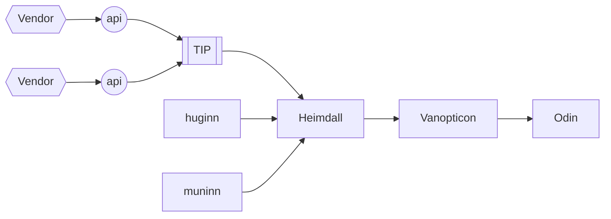

# Vanopticon Architecture

```mermaid
graph LR
    vendor{{Vendor}} --> api((api))
        --> tip[[TIP]]
        --> heimdall[Heimdall]
    vendor2{{Vendor}} --> api2((api))
        --> tip
    heimdall --> Vanopticon --> Odin
    huginn --> heimdall
    muninn --> heimdall
```
