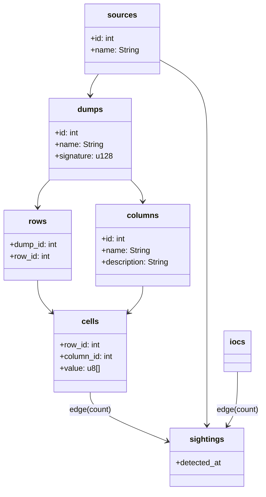

# Heimdall Graph Data Model

This document describes Heimdall's graph-centric data model for representing and correlating security-relevant entities. It combines traditional tabular records with graph nodes and edges to model indicators of compromise (IoCs), their occurrences in data dumps, and the relationships between fields, categories, and infrastructure. The model supports deduplication of repeated values, provenance tracking across rows/fields/dumps, and expressive graph queries that surface context and linkage at scale.

