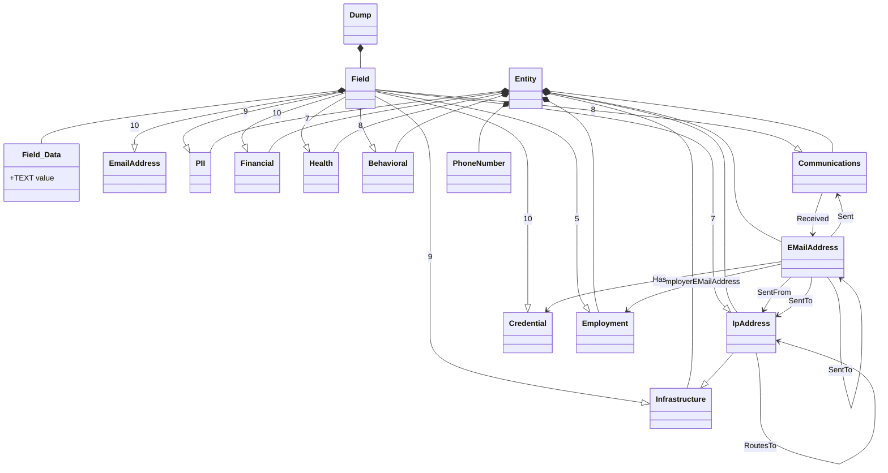

# Data Dump Graph Overview

```mermaid
classDiagram
    class Dump {

    }
    Dump *-- Field

    class Field {

    }
    Field *-- Field_Data
    Field --|> IpAddress : 7
    Field --|> EmailAddress : 10
    Field --|> Credential : 10
    Field --|> PII : 9
    Field --|> Financial : 10
    Field --|> Health : 7
    Field --|> Behavioral : 8
    Field --|> Employment :5
    Field --|> Infrastructure :9
    Field --|> Communications :8

    class Field_Data {
        +TEXT value
    }

    class Entity

    class IpAddress
    class EmailAddress
    class PhoneNumber
    class Credential
    class PII
    class Financial
    class Health
    class Behavioral
    class Employment
    class Infrastructure
    class Communications

    Entity *-- IpAddress
    Entity *-- EMailAddress
    Entity *-- PhoneNumber
    Entity *-- PII
    Entity *-- Financial
    Entity *-- Health
    Entity *-- Behavioral
    Entity *-- Employment
    Entity *-- Infrastructure
    Entity *-- Communications

    IpAddress --|> Infrastructure
    IpAddress --> IpAddress : RoutesTo
    EMailAddress --> IpAddress : SentFrom
    EMailAddress --> IpAddress : SentTo
    EMailAddress --> EMailAddress : SentTo
    EMailAddress --> Employment : EmployerEMailAddress
    EMailAddress --> Credential : Has
    EMailAddress --> Communications : Sent
    Communications --> EMailAddress : Received
```
